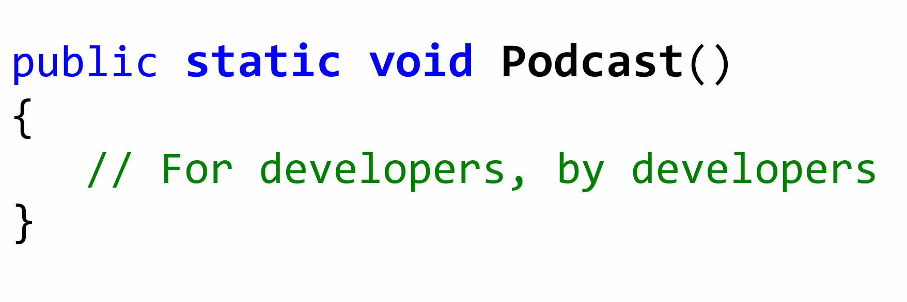
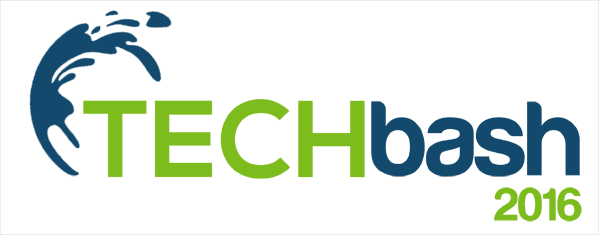

<h3>Host of <a href="http://www.staticvoidpodcast.com">The Static Void Podcast</a></h3>

Created The Static Void Podcast in June 2015 to help .NET developers stay up-to-date with relevant emerging technology trends.

<h3>Founding member of <a href="http://www.techbash.com">TechBASH Developer Conference</a></h3>

One of several organizers of the first major developer Conference in the Philadelphia area.

<h3>Leader of the <a href="http://www.njdotnet.org">Central New Jersey .NET User Group</a></h3>

Organizing amazing community speaking events in the central New Jersey area along with Todd Snyder since 2005.

<h3>Speaker and Track Lead at <a href="http://www.phillydotnet.org">Philly.NET User Group</a></h3>

 

<h2><a href="#Presentations">Technical Presentations</a></h2>

### [Introduction to TypeScript](https://www.youtube.com/watch?v=qRD7bkK7m10) (Video)
Free training video introducing developers to everything they need to know in order to become productive with the TypeScript programming language.
