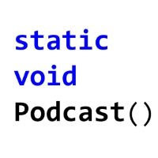

<h3>Host of [The Static Void Podcast](http://www.staticvoidpodcast.com)</h3>

Created The Static Void Podcast in June 2015 to help .NET developers stay up-to-date with relevant emerging technology trends.

### Founding member of [TechBASH Developer Conference](http://www.techbash.com)
One of several organizers of the first major developer Conference in the Philadelphia area.

### Leader of the [Central New Jersey .NET Developer Group (NJDOTNET)](http://www.njdotnet.org)
Organizing amazing community speaking events in the central New Jersey area along with Todd Snyder since 2005.

### Various Technical Presentations

#### [Introduction to TypeScript](https://www.youtube.com/watch?v=qRD7bkK7m10) (Video)
Free training video introducing developers to everything they need to know in order to become productive with the TypeScript programming language.
